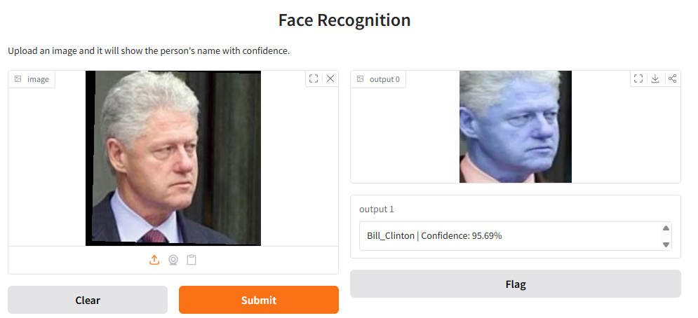

# **Face Recognition System using ArcFace**

## **Project Overview**

This project implements a **Face Recognition System** using Python, OpenCV, and DeepFace. It leverages the **ArcFace model** to generate **512-dimensional embeddings** for each face and recognizes people by comparing embeddings using **cosine similarity**.

The system can:

- Detect faces in images using OpenCV  
- Extract face embeddings using ArcFace  
- Recognize known individuals efficiently  
- Store embeddings and labels for quick lookup  
- Optional: Interactive demo using Gradio  

---

## **Dataset**

The dataset folder `Peoples/` contains images of individuals organized by name.  

**Folder structure example:**

Peoples/
├── Person1/
│ ├── img1.jpg
│ ├── img2.jpg
├── Person2/
│ ├── img1.jpg
│ └── ...

## **Usage**

1. Download and extract the dataset (`Peoples/`) and model embeddings (`model/`).  
2. Open `Face Recognition.ipynb` in Jupyter Notebook.  
3. Run cells step-by-step:  
   - Extract faces  
   - Generate embeddings (optional if using precomputed model)  
   - Recognize faces in new images  

---

## **Skills & Technologies**

- Python, OpenCV  
- DeepFace, ArcFace embeddings  
- NumPy, Cosine Similarity  
- Git & GitHub  
- Optional: Gradio for interactive demo  

---

## **Applications**

- Security and access control systems  
- Attendance automation  
- Personal photo organization  
- AI experiments in face recognition  

---

## **Output / Demo**

Here is an example output from the project:

*Detected faces labeled with names*  

---

## **Installation**

Clone the repository:

git clone https://github.com/Umar5199/Face-Recognition-System.git

